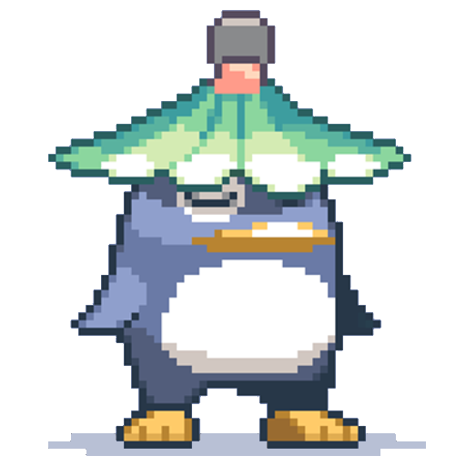

# NeuzOS

[](https://github.com/thatmounaim/neuzos/releases)
[](https://discord.gg/k3EY7Z6MMP)

An Electron WebView based Multi Client for Flyff Universe with Svelte and TypeScript.



## How to Use

[Shiraho's Youtube Video on NeuzOS v1](https://youtu.be/nu7v5rQQFcI)
Thank you Shiraho for the Showcase

As of today there is no official video guide for v2, but the discord has great written guides written by Cezay.

## Features

### Session Management
- **Multi-session support** — run multiple Flyff Universe accounts simultaneously, each in its own isolated browser partition
  - Custom icon and label per session
  - Launch URL override per session
  - Shared or isolated browser data partition (useful for non-game sessions like YouTube/Netflix to save disk space)
  - Clear cache / clear storage per session
- **Per-session zoom** — set an independent zoom level (50 %–150 %) for each session pane
  - Hover-activated zoom toolbar in the bottom-right corner of each pane
  - Fine-tune or reset instantly; zoom is persisted across app restarts
  - Also configurable per session from Settings → Sessions

### Layout System
- Define any number of layouts, each with its own icon and name
- Arrange sessions in rows within each layout
- **Default layouts on startup** — configure which layouts open automatically when the app launches
- Right-click a layout tab for quick actions:
  - **Mass actions**: Start/Stop all sessions, Mute/Unmute all sessions
  - **Per-session actions**: Start/Stop, Mute/Unmute individual sessions
  - **Tab actions**: Move left/right, Close

### Session Health Monitor
- **Crash overlay** — if a session's renderer process crashes, a full-pane overlay appears with a human-readable reason (killed by OS, out of memory, etc.) and a "Reload Session" button
- **Load-failure overlay** — if a session URL fails to load (DNS failure, network error, invalid URL), an overlay shows the error code and a "Retry" button
- **Unresponsive indicator** — an amber pulsing ring appears around a session pane if it becomes temporarily unresponsive
- Health state is preserved when switching between layout tabs

### Config Import / Export (Backup)
Available under **Settings → Backup**:
- **Export** — saves session actions, keybinds, keybind profiles and active profile to a portable JSON file via a native Save dialog
- **Import with preview** — select a JSON backup, review item counts and any warnings before applying
- **Replace mode** — replaces all current session actions, keybinds and profiles with the backup
- **Merge mode** — adds only items that don't already exist (deduplication by ID / key); nothing is deleted

### Keybinds & Shortcuts
- Global bindable shortcuts:
  - Switch between last two used layouts
  - Toggle fullscreen
  - Switch to a specific layout by ID
- Keybind profiles — create multiple profiles and switch between them at runtime
- Session Actions — define in-game key macros per session and trigger them from the UI or via keybinds

### Window & Display
- **Focus session on hover** — the active webview automatically receives focus when you hover over it
- **Pop-out session window** — launch any session in its own dedicated window with optional focus/fullscreen mode
- **Accidental exit protection** — closing the window or pressing the OS quit shortcut three times in a row is required to actually exit
  - Windows: Alt+F4 × 3
  - macOS: Cmd+Q × 3

### Advanced
- **Chromium flags** — enable/disable GPU, rendering and performance flags from Settings → Launch Settings
- **Launcher mode** (`--mode=session_launcher`) — a minimal launcher window to start individual sessions
- **Direct session launch** via command-line:
  ```
  --mode=session|focus|focus_fullscreen --session_id=<id>
  ```

## Download Pre-compiled Binaries

[View Latest Releases](https://github.com/thatmounaim/neuzos/releases)
## Project Setup - Build From Source

### Clone Project Repository
```bash
$ git clone https://github.com/thatmounaim/neuzos.git
```

### Install Dependencies

```bash
$ bun install
$ bun postinstall
```

### Build

```bash
# For windows
$ bun build:win

# For macOS
$ bun build:mac

# For Linux
$ bun build:linux
```

## Dev Notes

The base of the project was generate with [electron-vite](https://electron-vite.org/) using the Svelte Template
Some TS Warnings might appear in editor, found it okay to ignore, will give more importance to it in future.

```bash
# Run Devmode
$ bun dev
```
